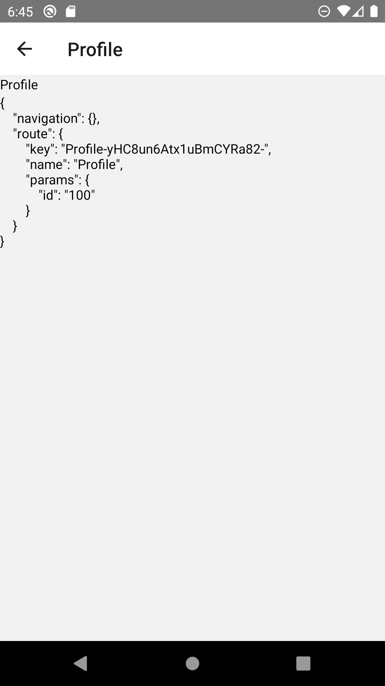

# deeplink

## npx uri-scheme open demo://app/home

## npx uri-scheme open demo://app/profile/100

## npx uri-scheme open demo://app/setting

```javascript
const config = {
  screens: {
    Home: 'home',
    Profile: {
      path: 'profile/:id',
      parse: {
        id: id => `${id}`,
      },
    },
    Notifications: 'notifications',
    Settings: 'setting',
  },
};

const linking = {
  prefixes: ['demo://app'],
  config,
};

export default linking;
```

---

```javascript
const MyStack = () => {
  return (
    <Stack.Navigator>
      <Stack.Screen name="Home" component={Home} />
      <Stack.Screen name="Notifications" component={Notifications} />
      <Stack.Screen name="Profile" component={Profile} />
      <Stack.Screen name="Settings" component={Settings} />
    </Stack.Navigator>
  );
};

const App = () => {
  return (
    <NavigationContainer linking={linking}>
      <MyStack />
    </NavigationContainer>
  );
};
```

```xml
<manifest
  xmlns:android="http://schemas.android.com/apk/res/android"
  package="com.deeplinking"
>

    <uses-permission android:name="android.permission.INTERNET" />

    <application
    android:name=".MainApplication"
    android:label="@string/app_name"
    android:icon="@mipmap/ic_launcher"
    android:roundIcon="@mipmap/ic_launcher_round"
    android:allowBackup="false"
    android:theme="@style/AppTheme"
  >
      <activity
      android:name=".MainActivity"
      android:label="@string/app_name"
      android:configChanges="keyboard|keyboardHidden|orientation|screenSize|uiMode"
      android:launchMode="singleTask"
      android:windowSoftInputMode="adjustResize"
    >
        <intent-filter>
            <action android:name="android.intent.action.MAIN" />
            <category android:name="android.intent.category.LAUNCHER" />
        </intent-filter>

        <intent-filter>
          <action android:name="android.intent.action.VIEW" />
          <category android:name="android.intent.category.DEFAULT" />
          <category android:name="android.intent.category.BROWSABLE" />
          <data android:host="app" android:scheme="demo" />
        </intent-filter>
      </activity>
    </application>
</manifest>
```

---

```javascript
import React from 'react';
import {Text, View} from 'react-native';
function Profile(props) {
  return (
    <View>
      <Text>Profile</Text>
      <Text>{JSON.stringify(props, null, 4)}</Text>
    </View>
  );
}

export default Profile;
```


